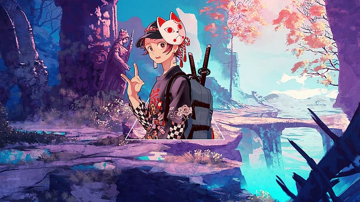
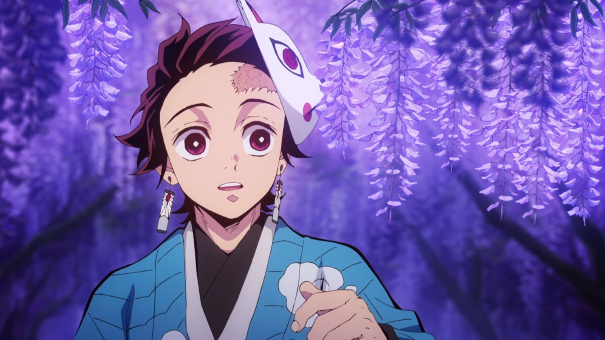
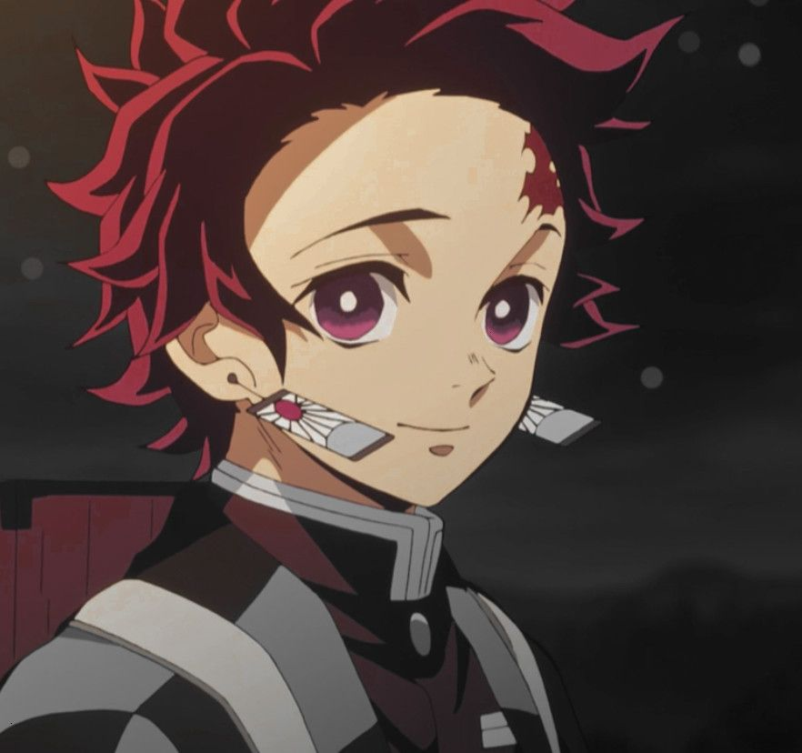
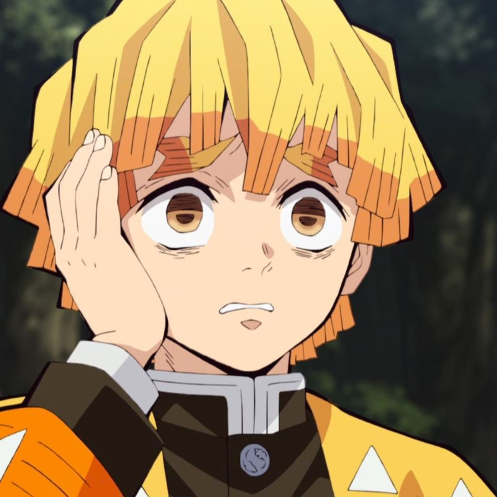

<!DOCTYPE html>
<html lang="en">
<head>
	<meta charset="utf-8">
	<title>Practica Final</title>
	<meta name="viewport" content="width=device-width, user-scalable=no, initial-scale=1.0, maximum-scale1.0, minimum-scale=1.0">
	<link rel="stylesheet" href="css/bootstrap.min.css">
</head>
<body background="uwu.jpg">
     <!-- NAVBAR-->
	<nav class="navbar navbar-expand-md navbar-dark bg-dark">
  

    <a class="navbar-brand" href="#">
         
         Navbar
         </a>
    <button class="navbar-toggler" type="button" data-bs-toggle="collapse" data-bs-target="#navbarSupportedContent" aria-controls="navbarSupportedContent" aria-expanded="false" aria-label="Toggle navigation">
      
    </button>
    

      <ul class="navbar-nav m-auto mb-2 mb-lg-0">
        <li class="nav-item">
          <a class="nav-link active" aria-current="page" href="#">Home</a>
        </li>
        <li class="nav-item">
          <a class="nav-link" href="#">Link</a>
        </li>
        <li class="nav-item dropdown">
          <a class="nav-link dropdown-toggle" href="#" id="navbarDropdown" role="button" data-bs-toggle="dropdown" aria-expanded="false">
            Dropdown
          </a>
          <ul class="dropdown-menu" aria-labelledby="navbarDropdown">
            <li><a class="dropdown-item" href="#">Action</a></li>
            <li><a class="dropdown-item" href="#">Another action</a></li>
            <li>
</li>
            <li><a class="dropdown-item" href="#">Something else here</a></li>
          </ul>
        </li>
        <li class="nav-item">
          <a class="nav-link disabled" href="#" tabindex="-1" aria-disabled="true">Disabled</a>
        </li>
      </ul>
      
         14488-2 Nicole Valdez
    
      <form class="d-flex">
        <input class="form-control me-2" type="search" placeholder="Search" aria-label="Search">
        <button class="btn btn-outline-success" type="submit">Search</button>
      </form>
    

  

</nav>

 <!-- NAVBAR-->

<!--SLIDER-->

  <ol class="carousel-indicators">
    <li data-target="#carouselExampleIndicators" data-slide-to="0" class="active"></li>
    <li data-target="#carouselExampleIndicators" data-slide-to="1"></li>
    <li data-target="#carouselExampleIndicators" data-slide-to="2"></li>
  </ol>
  

    

      
    

    

      
    

    

      
    

  

  <a class="carousel-control-prev" href="#carouselExampleIndicators" role="button" data-slide="prev">
    
    Previous
  </a>
  <a class="carousel-control-next" href="#carouselExampleIndicators" role="button" data-slide="next">
    
    Next
  </a>

<!--SLIDER-->

<!--SECTION UNO-->
<section class="container my-5">
	<H2 class="display-4 text-center">kimetsu no yaiba</H2>
	
Kimetsu no Yaiba (鬼滅の刃? lit. «espada mata-demonios»), también conocida bajo su nombre en inglés Demon Slayer y como Guardianes de la noche en España, es una serie de manga escrita e ilustrada por Koyoharu Gotōge, cuya publicación comenzó el 15 de febrero de 2016 en la revista semanal Shūkan Shōnen Jump de la editorial Shūeisha. Una adaptación a serie de anime producida por el estudio Ufotable fue estrenada el 6 de abril de 2019 y finalizó el 28 de septiembre de ese mismo año. La continuación de la historia fue adaptada en formato de película y se llamó Kimetsu no Yaiba: Mugen Ressha-hen, se estrenó el 16 de octubre de 2020 en Japón, convirtiéndose en la película más taquillera en la historia de dicho país. Una segunda temporada del anime y continuación de la película está confirmada para el mes de julio de 2021.

Hasta febrero de 2021, el manga ya contaba con 23 volúmenes publicados y con 150 millones de copias en circulación, incluidos copias digitales, convirtiéndolo en una de las series de manga más vendidas de la historia.

  <H2 class="display-4 text-center">Argumento</H2>

<section class="container my-5">
  <H2 class="display-4 text-center">kimetsu no yaiba</H2>
  
Ambientada en la era Taisho, la historia se centra en Tanjirō Kamado, un joven inteligente y de buen corazón que vive con su familia en las montañas. Se ha convertido en la única fuente de ingresos de su familia tras el fallecimiento de su padre, haciendo viajes al pueblo cercano para vender carbón y vegetales. Todo cambia cuando, tras uno de estos viajes, regresa a casa solo para descubrir que su familia ha sido atacada y asesinada por un demonio. Tanjirō y su hermana Nezuko son los únicos supervivientes del incidente, con Nezuko transformada en un demonio, pero todavía mostrando signos de emoción y pensamiento humanos. Después de un encuentro con Giyū Tomioka, un asesino de demonios, Tanjirō es reclutado por este y enviado para que Sakonji Urokodaki, otro miembro del Cuerpo de Asesinos de Demonios, le enseñe a convertirse también en un asesino de demonios, y comienza su búsqueda para ayudar a su hermana a convertirse nuevamente en humana y vengar la muerte del resto de su familia.

	<H2 class="display-4 text-center">Personajes principales</H2>
	<!--CARD-->
	

  

    

      
      

        <h5 class="card-title">Tanjiro Kamado</h5>
        
Tanjiro Kamado (竈門かまど 炭たん治じ郎ろう, Kamado Tanjirō?) es el protagonista principal de Kimetsu no Yaiba. Es un cazador de Demonios cuyo principal objetivo es encontrar al responsable de haber matado a su familia y convertido a su hermana Nezuko en un Demonio.

      

      

        <small class="text-muted">Tanjiro</small>
      

    

  

  

    

      
      

        <h5 class="card-title">Nezuko Kamado</h5>
        
Nezuko Kamado (竈門かまど禰ね豆ず子こ, Kamado Nezuko?) es la hermana menor de Tanjiro. Ella fue transformada en Demonio por Muzan Kibutsuji acompañando a Tanjiro en su viaje para volver a ser humana. Es una de las protagonistas principales de Kimetsu no Yaiba. Después de consumir la droga experimental de Tamayo, Nezuko recuperó su humanidad.

      

      

        <small class="text-muted">Nezuko-Chan</small>
      

    

  

  

    

      
      

        <h5 class="card-title">Zenitsu Agatsuma</h5>
        
Zenitsu Agatsuma (我あが妻つま善ぜん逸いつ, Agatsuma Zen'itsu?) es un Cazador de Demonios y un compañero de viaje de Tanjiro Kamado. A su vez es uno de los personajes principales de Kimetsu no Yaiba.

      

      

        <small class="text-muted">Zenitsu</small>

<!--CARD-->

</section><!--SECTION UNO-->

<!-- Jumbotron -->

	

		<h1 class="display-4"></h1>
        
Espero te este gustando la pagina

        

        
´Puedes ver la serie en una de estas paginas: Anime flv, Anime JK

        <a class="btn btn-primary btn-lg" href="#" role="button">Leer mas sobre la serie</a>
  

<!-- Jumbotron -->
<!-- SECTION2 -->
<section class="container">
	<H2 class="display-4 text-center">Terminología</H2>
	
Demonios (鬼 Oni?)
Los demonios son criaturas malvadas que se alimentan de carne y sangre humana. Muzan Kibutsuji sería el primer demonio y, con su sangre, puede convertir a los humanos en demonios. Pueden cambiar la estructura de su cuerpo a voluntad, curar sus heridas rápidamente y poseen fuerza y agilidad sobrehumana. Solo se pueden matar al exponerlos a la luz del sol o si se decapitan con una espada Nichirinto.

12 Lunas (十二鬼月 Jūni kizuki?)
Son los doce demonios más poderosos bajo el mando de Muzan Kibutsuji. Se dividen en dos grupos, lunas superiores y lunas inferiores, cuyo nivel y número está marcado en sus ojos.

Asesinos de demonios (鬼殺隊 Ki-satsutai?)
Un término que designa tanto a la organización, cuya misión es proteger a la humanidad de los demonios, así como a los guerreros que la componen. Ha existido durante mucho tiempo.

Pilares (柱 Hashira?)
Son los nueve espadachines más poderosos entre los cazadores de demonios. Estos son: Giyū Tomioka (pilar de agua), Shinobu Kōchō (pilar del insecto), Kyōjurō Rengoku (pilar de la llama), Mitsuri Kanrōji (pilar del amor), Obanai Iguro (pilar serpiente), Sanemi Shinazugawa (pilar del viento), Gyōmei Himejima (pilar de la roca), Tengen Uzui (pilar del sonido) y Muichirō Tokito (pilar de la niebla).

	

<!--ACORDION -->

  

    <h2 class="accordion-header" id="headingOne">
      <button class="accordion-button" type="button" data-bs-toggle="collapse" data-bs-target="#collapseOne" aria-expanded="true" aria-controls="collapseOne">#1
      </button>
    </h2>
    

      

        <strong>Escrito e ilustrado por Koyoharu Gotōge.

Kimetsu no Yaiba comenzó su serialización en la edición #11 del 2016 del semanario Shōnen Jump de Shūeisha el 15 de febrero de 2016.7​ Se publicó una historia paralela para el manga en el primer número de Shonen Jump GIGA el 20 de julio de 2016.8​ Shūeisha comenzó a lanzar simultáneamente la serie en español en el servicio Manga Plus en enero de 2019.

Finalizó el 15 de mayo de 2020 con la publicación del capítulo 205 en la revista semanal Shōnen Jump de Shūeisha. En formato volumen, a fecha de octubre de 2020, se publicaron un total de 22 volúmenes y 205 capítulos en Japón. Los capítulos restantes está previsto que se publiquen en dos volúmenes adicionales (hasta formar un total de 23 tomos) en octubre y diciembre de 2020.

Norma Editorial publicó el primer volumen en español para España el 8 de marzo de 2019,9​ mientras que la editorial Ivrea lanzó el primer tomo para Argentina el 6 de diciembre de 2019.10​ En México, Panini Manga empezará la publicación del manga en marzo de 2020.
    

  

  

    <h2 class="accordion-header" id="headingTwo">
      <button class="accordion-button collapsed" type="button" data-bs-toggle="collapse" data-bs-target="#collapseTwo" aria-expanded="false" aria-controls="collapseTwo">#2
      </button>
    </h2>
    

      

        <strong>La adaptación a serie de anime por el estudio Ufotable fue anunciada en el número 27 de la revista Weekly Shōnen Jump el 4 de junio de 2018.48​ La serie se emitió del 6 de abril al 28 de septiembre de 2019 en Tokyo MX, GTV, GYT, BS11 y otros canales.49​50​ El anime fue dirigido por Haruo Sotozaki, con guiones del personal de Ufotable, música de Yuki Kajiura y Go Shiina, y diseño de personajes de Akira Matsushima. El tema de apertura es «Gurenge» (紅蓮華?) de LiSA,51​ mientras que el tema de cierre es «from the edge» (フロム・ジ・エッジ Furomu ji ejji?) de FictionJunction y LiSA.52​ El ending para el episodio 19 es «Kamado Tanjirō no Uta» (竈門炭治郎のうた?) de Go Shiina con Nami Nakagawa. Fue emitido en streaming por Crunchyroll, Hulu y FunimationNow.53​ AnimeLab transmitió simultáneamente la serie en Australia y Nueva Zelanda.54​
      

    

  

  

    <h2 class="accordion-header" id="headingThree">
      <button class="accordion-button collapsed" type="button" data-bs-toggle="collapse" data-bs-target="#collapseThree" aria-expanded="false" aria-controls="collapseThree"> #3
      </button>
    </h2>
    

      

        <strong>El 28 de septiembre de 2019, inmediatamente después de la emisión del episodio 26, se anunció una película de anime titulada Demon Slayer: Kimetsu no Yaiba the Movie: Mugen Train (鬼 滅 の 刃 無限 列車 編, Kimetsu no Yaiba: Mugen Ressha-hen), con el personal y el elenco repitiendo sus roles.55​ La película es una secuela directa de la serie de anime y cubre los eventos del arco de la historia de "Mugen Train", capítulos cincuenta y tres al sesenta y nueve del manga. La película se estrenó en Japón el 16 de octubre de 2020.56​ La película es distribuida en Japón por Aniplex y Toho.57​
      
<!--ACORDION -->
    

  

   

</section>

<!-- SECTION2 -->
<footer class="bg-dark text-white">
	

© Derechos reservados Nicole Valdez 14488-2

</footer>
</body>

</html>
